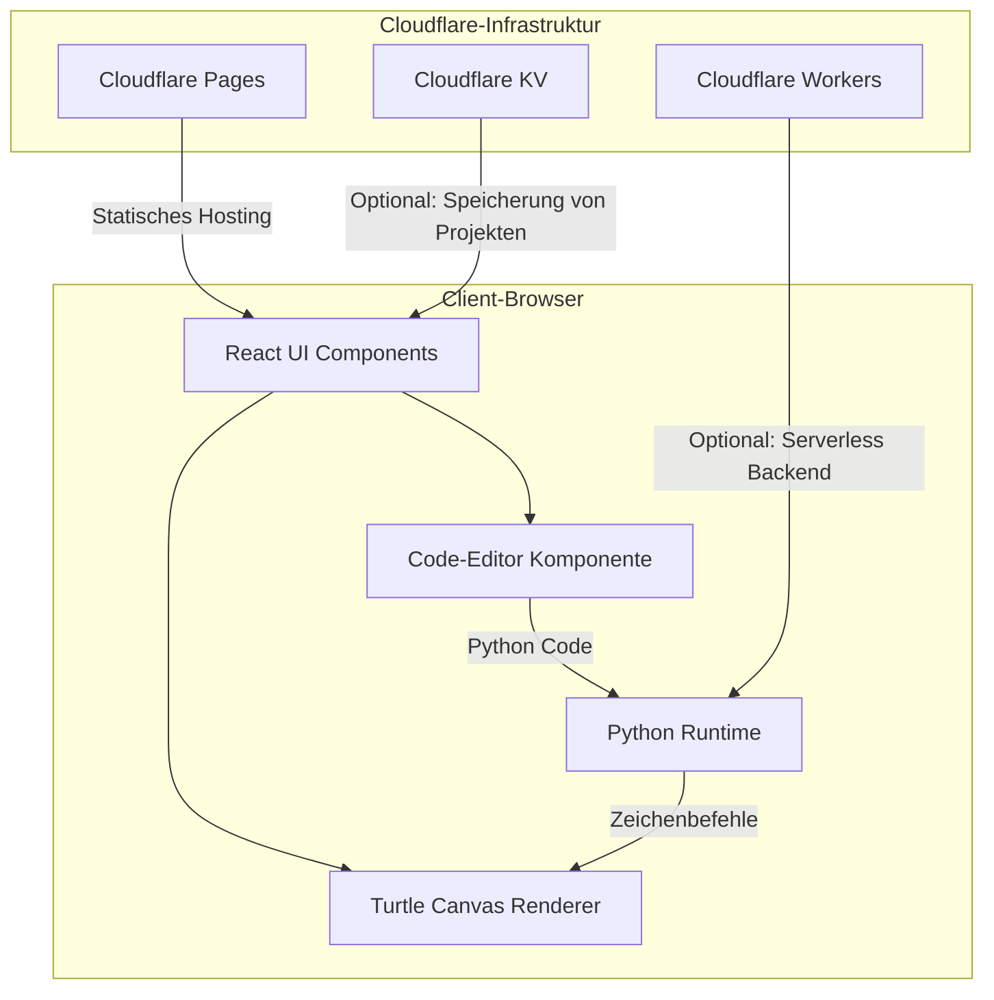
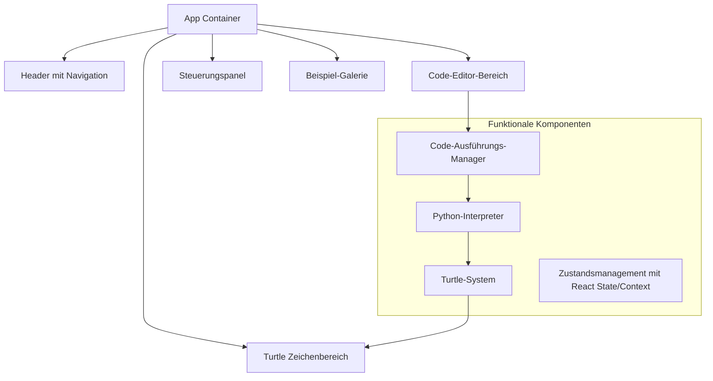
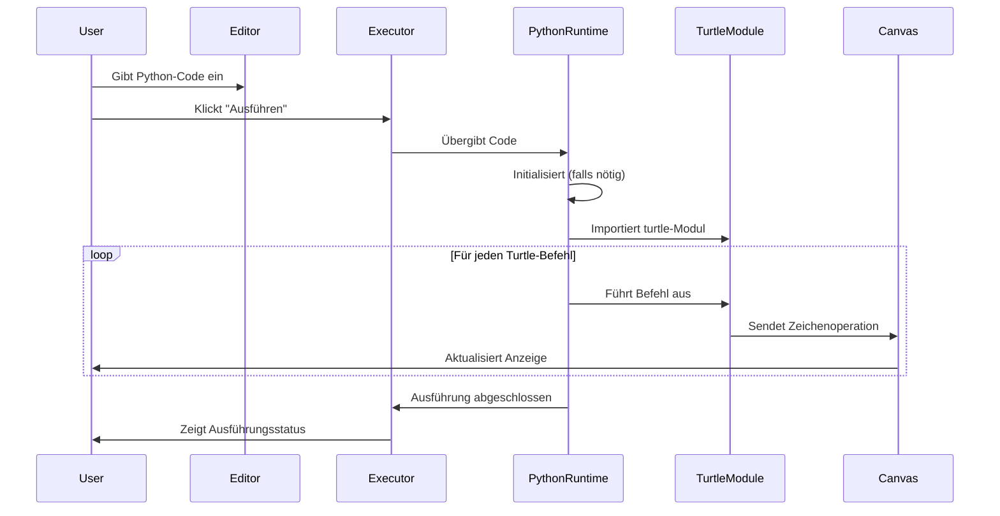
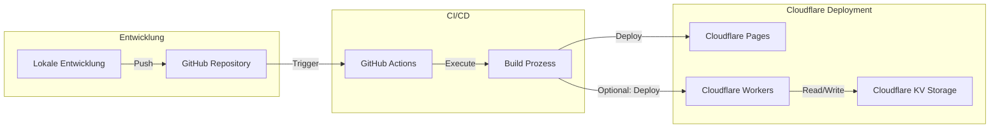

# Python Turtle im Browser mit Vite + React + Hono auf Cloudflare

## 1. Gesamtübersicht der Architektur



## 2. Entscheidung zur Python-Runtime im Browser

Basierend auf Ihrer ursprünglichen Recherche gibt es drei Hauptansätze:

#### Option A: Pyodide (WebAssembly-basiert)
- **Vorteile**:
  - Vollständige CPython-Implementierung
  - Zugriff auf viele Python-Bibliotheken
  - Beste Performanz unter den Browser-Python-Optionen
  - Unterstützt echtes Python-Verhalten
- **Nachteile**:
  - Größere Download-Größe (~10-12MB für die Basisinstallation)
  - Initialisierung kann langsamer sein

#### Option B: Skulpt (Python-zu-JavaScript-Transpiler)
- **Vorteile**:
  - Spezifisch für Bildungsanwendungen optimiert
  - Leichtgewichtiger als Pyodide
  - Hat bereits eine Turtle-Implementierung
- **Nachteile**:
  - Eingeschränkte Python-Unterstützung
  - Verhält sich nicht immer exakt wie echtes Python

#### Option C: Brython (Python-zu-JavaScript-Transpiler)
- **Vorteile**:
  - Eng an der Python-Syntax orientiert
  - Einfache DOM-Manipulation
  - Leichtgewichtiger als Pyodide
- **Nachteile**:
  - Benötigt möglicherweise eigene Turtle-Implementierung
  - Weniger Bibliotheksunterstützung als Pyodide

**Entscheidung und Empfehlung**: Für dieses Projekt wurde **Pyodide** aufgrund seiner vollständigen CPython-Implementierung und der besten Performanz für authentisches Python-Verhalten im Browser gewählt. Dies ist ideal, wenn die Zielgruppe moderne Browser mit guter Internetverbindung nutzt.

## 3. Hauptkomponenten der Anwendung



## 4. Detaillierte Komponentenbeschreibung

#### UI-Komponenten (React)

1. **Code-Editor**
   - Verwendet Monaco Editor oder CodeMirror
   - Syntax-Highlighting für Python
   - Autocompletion für Turtle-Befehle
   - Zeilennummerierung

2. **Turtle-Canvas**
   - HTML5 Canvas-Element (`TurtleCanvas.vue`)
   - Renderer für Turtle-Grafiken, der auf Befehle vom `TurtleService` reagiert.
   - Implementierte Funktionen: `forward`, `left`, `right`, `penup`, `pendown`, `goto`, `pencolor`, `pensize`, `circle`, `begin_fill`, `end_fill`, `speed`, `showturtle`, `hideturtle` und `reset`.
   - Zukünftig: Animations-Controls (Geschwindigkeit, Pause), Zoom/Pan.

3. **Steuerungspanel**
   - Ausführen/Stopp-Schaltflächen (`ControlPanel.vue`). Events für "Ausführen" und "Zurücksetzen" werden an die Hauptanwendungskomponente gesendet.
   - Geschwindigkeitsregler (zukünftig).
   - Zurücksetzen-Funktion (initiiert über Event).
   - Export-Optionen (zukünftig).

4. **Beispiel-Galerie**
   - Vorgefertigte Python Turtle-Beispiele
   - Sortierung nach Schwierigkeitsgrad
   - Live-Vorschau

#### Python-Integration

1. **Pyodide Integration (`PythonRuntimeService.ts`)**
   - Asynchrone Initialisierung von Pyodide.
   - Lädt Pyodide und stellt eine Methode (`runPythonCode`) zur Ausführung von Python-Skripten bereit.
   - Stellt Python-Funktionen (wie `print` und Turtle-Befehle) global für den ausgeführten Code bereit.
   - Das `turtle`-Modul wird dynamisch im Python-Kontext erstellt und seine Funktionen rufen JavaScript-Handler im `TurtleService` auf.

2. **Turtle-Implementierung (`TurtleService.ts` und `TurtleCanvas.vue`)**
   - `TurtleService.ts`:
     - Definiert JavaScript-Funktionen, die den Turtle-Befehlen entsprechen (z.B. `forward`, `left`, `pencolor`).
     - Diese Funktionen werden vom Python-Code über die in `PythonRuntimeService.ts` eingerichtete Brücke aufgerufen.
     - Verwendet einen Event-Emitter, um Zeichenbefehle und Zustandsänderungen an den `TurtleCanvas.vue` zu senden.
     - Verfolgt den grundlegenden Turtle-Zustand (Position, Winkel, Stiftzustand, Farbe, etc.).
   - `TurtleCanvas.vue`:
     - Hört auf Events vom `TurtleService`.
     - Führt die tatsächlichen Zeichenoperationen auf dem HTML5-Canvas durch.
     - Implementiert die Logik für das Bewegen der Turtle, das Ändern von Stifteigenschaften und das Zeichnen von Formen.

## 5. Datenfluss und Interaktionen



## 6. Deployment-Strategie mit Cloudflare



**Deployment-Prozess:**

1. **Projektsetup:**
   ```bash
   npm create cloudflare@latest -- --template=cloudflare/templates/vite-react-template
   ```

2. **Projektstruktur und Entwicklung:**
   - `/src` - React-Komponenten und Frontend-Logik
   - `/functions` - Cloudflare Workers für serverseitige Funktionen
   - `/public` - Statische Assets

3. **Lokale Entwicklung mit Wrangler:**
   ```bash
   npm run dev
   ```

4. **Deployment auf Cloudflare:**
   ```bash
   npm run deploy
   ```

5. **Cloudflare-Konfiguration:**
   - Konfiguration automatisch durch Wrangler
   - Möglichkeit zur angepassten Domainzuweisung
   - Einrichtung von Umgebungsvariablen über Cloudflare Dashboard

## 7. Performance-Optimierungen

1. **Code-Splitting:**
   - Laden der Pyodide-Runtime erst, wenn benötigt
   - Aufteilung großer Komponenten für schnelleres initiales Laden

2. **Caching-Strategien:**
   - Cloudflare Cache für statische Assets
   - ServiceWorker für Offline-Unterstützung
   - Lokales Caching der Python-Runtime

3. **Progressive Enhancement:**
   - Basis-Funktionalität auch ohne WebAssembly
   - Erweiterter Funktionsumfang mit Pyodide

## 8. Benutzeroberfläche und Interaktion

Die Benutzeroberfläche könnte folgendermaßen aussehen:

```
+-------------------------------------------------------+
|                      Header                           |
+------------------+----------------------------------+--+
|                  |                                  |  |
|                  |                                  |  |
|  Code-Editor     |       Turtle Canvas             |  |
|                  |                                  |  |
|                  |                                  |  |
|                  |                                  |  |
|                  |                                  |  |
+------------------+                                  |  |
| Run | Reset | ▶ |                                  |  |
+------------------+----------------------------------+  |
|                                                        |
|                  Examples Gallery                      |
|                                                        |
+-------------------------------------------------------+
```

**Interaktionsmuster:**

1. **Code-Eingabe und -Ausführung:**
   - User gibt Python-Code in den Editor ein
   - Klick auf "Run" führt Code aus
   - Echtzeit-Visualisierung im Canvas

2. **Lernoptionen:**
   - Schritt-für-Schritt-Ausführung für Bildungszwecke
   - Verlangsamte Animation für besseres Verständnis
   - Hervorhebung des aktuell ausgeführten Codes

3. **Teilen und Speichern:**
   - Export der erzeugten Grafiken
   - Speichern und Teilen von Code-Snippets
   - Einbetten in andere Webseiten

## 9. Erweiterungsmöglichkeiten

1. **Mehrbenutzer-Kollaboration:**
   - Echtzeit-Zusammenarbeit am gleichen Code
   - Lehrer-Schüler-Interaktionen für Bildungszwecke

2. **KI-Unterstützung:**
   - Code-Vervollständigung
   - Automatische Fehlerkorrektur
   - Generierung von Beispielen

3. **Integration mit Bildungsplattformen:**
   - LMS-Integration (Moodle, Canvas, etc.)
   - Benutzer-Fortschrittsverfolgung
   - Aufgaben und Bewertungen

## 10. Technische Schulden und Risiken

1. **WebAssembly-Kompatibilität:**
   - Ältere Browser unterstützen WebAssembly möglicherweise nicht
   - Mobile Browser haben eingeschränkten WebAssembly-Support

2. **Größe der Python-Runtime:**
   - Initialer Download kann für Benutzer mit langsamer Verbindung problematisch sein
   - Lösungsansatz: Progressive Loading und Caching

3. **Limitierungen der Browser-Python-Umgebung:**
   - Nicht alle Python-Bibliotheken sind kompatibel
   - Speicherrestriktionen im Browser

4. **Canvas-Performance:**
   - Komplexe Turtle-Zeichnungen können die Performance beeinträchtigen
   - Lösungsansatz: Frame-Limiting und optimierte Rendering-Strategien

## 11. Implementierungsdetails Phase 2: Python-Runtime und Turtle-Integration

In dieser Phase wurde die Kernfunktionalität zur Ausführung von Python-Turtle-Code im Browser implementiert.

**Kernkomponenten und Services:**

*   **`PythonRuntimeService.ts`**:
    *   Verantwortlich für das Laden und Initialisieren der Pyodide-Runtime.
    *   Stellt eine Methode `runPythonCode(script: string, canvasContext: any, turtleServiceInstance: any)` bereit, um Python-Code auszuführen.
    *   Richtet eine Brücke ein, um Python-`print`-Anweisungen an die Browser-Konsole weiterzuleiten und Turtle-Befehle an den `TurtleService` zu delegieren.
    *   Ein benutzerdefiniertes `turtle`-Modul wird zur Laufzeit in Python erstellt, dessen Funktionen die entsprechenden JavaScript-Funktionen im `TurtleService` aufrufen.

*   **`TurtleService.ts`**:
    *   Implementiert die Logik für die einzelnen Turtle-Befehle (z.B. `forward(distance: number)`, `left(angle: number)`, `pencolor(color: string)`).
    *   Verwendet einen `mitt` Event-Emitter, um Zeichenaktionen (`drawCommand`) und Anforderungen zur Canvas-Aktualisierung (`renderCanvas`) an die `TurtleCanvas.vue`-Komponente zu senden.
    *   Verwaltet den Zustand der Turtle (Position, Winkel, Stift aktiv/inaktiv, Stiftfarbe, Stiftgröße).
    *   Beinhaltet eine `reset()`-Methode, um den Turtle-Zustand und das Canvas zurückzusetzen.

*   **`TurtleCanvas.vue`**:
    *   Enthält das HTML5-`<canvas>`-Element.
    *   Abonniert die Events des `TurtleService`.
    *   Führt die tatsächlichen Zeichenoperationen auf dem Canvas aus, wenn ein `drawCommand` empfangen wird.
    *   Implementiert die visuelle Darstellung der Turtle und ihrer Bewegungen.
    *   Unterstützt Befehle wie `forward`, `left`, `right`, `penup`, `pendown`, `goto`, `pencolor`, `pensize`, `circle`, `begin_fill`, `end_fill`, `speed`, `showturtle`, `hideturtle`.

*   **`MainApplicationView.vue`**:
    *   Orchestriert die Interaktion zwischen dem Code-Editor (derzeit eine `textarea`), dem `ControlPanel.vue` und dem `TurtleCanvas.vue`.
    *   Initialisiert `PythonRuntimeService` und `TurtleService`.
    *   Verwaltet den Ladezustand von Pyodide.
    *   Stellt Funktionen bereit, um den eingegebenen Python-Code auszuführen (`handleRunCode`) und das Canvas zurückzusetzen (`handleResetCanvas`), die vom `ControlPanel.vue` getriggert werden.
    *   Zeigt Fehlermeldungen an, die während der Pyodide-Initialisierung oder Code-Ausführung auftreten.

*   **`ControlPanel.vue`**:
    *   Stellt UI-Elemente (Buttons) zum Ausführen von Code und zum Zurücksetzen des Canvas bereit.
    *   Sendet Events (`run-code`, `reset-canvas`) an die `MainApplicationView.vue`.

**Datenfluss bei Code-Ausführung:**

1.  Benutzer gibt Code in `MainApplicationView.vue` ein und klickt "Ausführen" im `ControlPanel.vue`.
2.  `MainApplicationView.vue` ruft `pythonRuntimeService.runPythonCode()` auf.
3.  `PythonRuntimeService` führt den Code mit Pyodide aus.
4.  Python-Turtle-Befehle im Code rufen die entsprechenden JavaScript-Funktionen im `TurtleService` auf (über die Pyodide-Python-zu-JS-Brücke).
5.  `TurtleService` verarbeitet den Befehl, aktualisiert seinen internen Zustand und sendet ein `drawCommand`-Event an `TurtleCanvas.vue`.
6.  `TurtleCanvas.vue` empfängt das Event und zeichnet die entsprechende Grafik auf dem Canvas.

Diese Integration ermöglicht eine grundlegende Ausführung von Python-Turtle-Befehlen im Browser, wobei die Zeichenoperationen auf einem HTML5-Canvas visualisiert werden.
