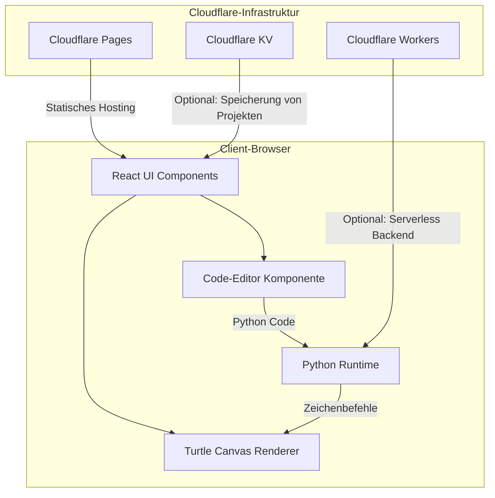
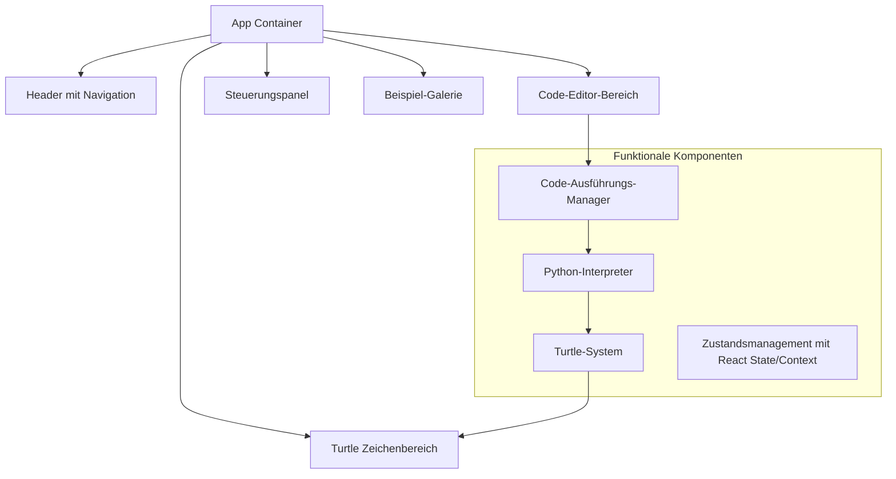
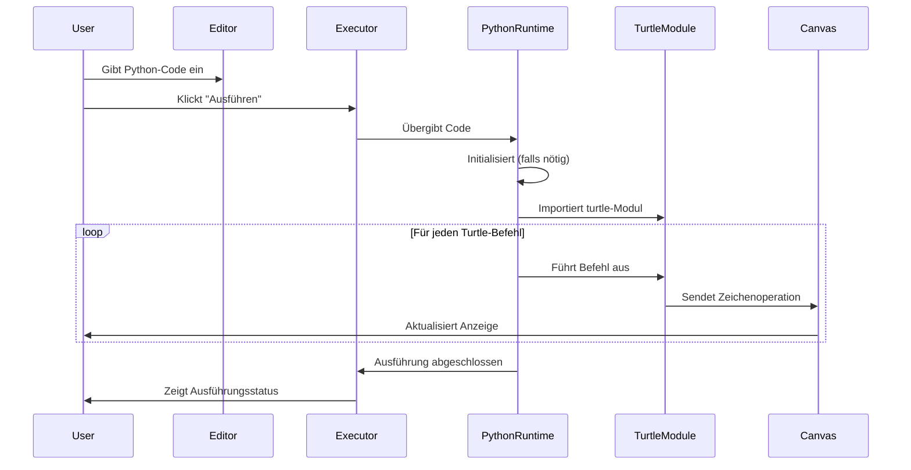
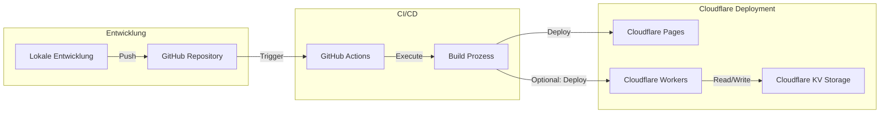

# Python Turtle im Browser mit Vite + React + Hono auf Cloudflare

## 1. Gesamtübersicht der Architektur



## 2. Entscheidung zur Python-Runtime im Browser

Basierend auf Ihrer ursprünglichen Recherche gibt es drei Hauptansätze:

#### Option A: Pyodide (WebAssembly-basiert)
- **Vorteile**:
  - Vollständige CPython-Implementierung
  - Zugriff auf viele Python-Bibliotheken
  - Beste Performanz unter den Browser-Python-Optionen
  - Unterstützt echtes Python-Verhalten
- **Nachteile**:
  - Größere Download-Größe (~10-12MB für die Basisinstallation)
  - Initialisierung kann langsamer sein

#### Option B: Skulpt (Python-zu-JavaScript-Transpiler)
- **Vorteile**:
  - Spezifisch für Bildungsanwendungen optimiert
  - Leichtgewichtiger als Pyodide
  - Hat bereits eine Turtle-Implementierung
- **Nachteile**:
  - Eingeschränkte Python-Unterstützung
  - Verhält sich nicht immer exakt wie echtes Python

#### Option C: Brython (Python-zu-JavaScript-Transpiler)
- **Vorteile**:
  - Eng an der Python-Syntax orientiert
  - Einfache DOM-Manipulation
  - Leichtgewichtiger als Pyodide
- **Nachteile**:
  - Benötigt möglicherweise eigene Turtle-Implementierung
  - Weniger Bibliotheksunterstützung als Pyodide

**Empfehlung**: Pyodide für die beste Kompatibilität und Authentizität, wenn Ihre Zielgruppe moderne Browser mit guter Internetverbindung nutzt. Skulpt für ressourcenschonendere Implementierungen, besonders wenn die Zielgruppe im Bildungsbereich liegt.

## 3. Hauptkomponenten der Anwendung



## 4. Detaillierte Komponentenbeschreibung

#### UI-Komponenten (React)

1. **Code-Editor**
   - Verwendet Monaco Editor oder CodeMirror
   - Syntax-Highlighting für Python
   - Autocompletion für Turtle-Befehle
   - Zeilennummerierung

2. **Turtle-Canvas**
   - HTML5 Canvas-Element
   - Renderer für Turtle-Grafiken
   - Animations-Controls (Geschwindigkeit, Pause, etc.)
   - Zoom/Pan-Funktionalität

3. **Steuerungspanel**
   - Ausführen/Stopp-Schaltflächen
   - Geschwindigkeitsregler
   - Zurücksetzen-Funktion
   - Export-Optionen (PNG, SVG)

4. **Beispiel-Galerie**
   - Vorgefertigte Python Turtle-Beispiele
   - Sortierung nach Schwierigkeitsgrad
   - Live-Vorschau

#### Python-Integration

1. **Pyodide Integration**
   - Initialisierungs-Handler
   - Python-Paket-Manager
   - Turtle-Modul-Loader
   - Python-zu-JS-Brücke

2. **Turtle-Implementierung**
   - Vollständige API-Unterstützung (forward, backward, left, right, etc.)
   - Ereignis-System für Zeichenoperationen
   - Zustandsverfolgung (Position, Ausrichtung, Stift-Status)

## 5. Datenfluss und Interaktionen



## 6. Deployment-Strategie mit Cloudflare



**Deployment-Prozess:**

1. **Projektsetup:**
   ```bash
   npm create cloudflare@latest -- --template=cloudflare/templates/vite-react-template
   ```

2. **Projektstruktur und Entwicklung:**
   - `/src` - React-Komponenten und Frontend-Logik
   - `/functions` - Cloudflare Workers für serverseitige Funktionen
   - `/public` - Statische Assets

3. **Lokale Entwicklung mit Wrangler:**
   ```bash
   npm run dev
   ```

4. **Deployment auf Cloudflare:**
   ```bash
   npm run deploy
   ```

5. **Cloudflare-Konfiguration:**
   - Konfiguration automatisch durch Wrangler
   - Möglichkeit zur angepassten Domainzuweisung
   - Einrichtung von Umgebungsvariablen über Cloudflare Dashboard

## 7. Performance-Optimierungen

1. **Code-Splitting:**
   - Laden der Pyodide-Runtime erst, wenn benötigt
   - Aufteilung großer Komponenten für schnelleres initiales Laden

2. **Caching-Strategien:**
   - Cloudflare Cache für statische Assets
   - ServiceWorker für Offline-Unterstützung
   - Lokales Caching der Python-Runtime

3. **Progressive Enhancement:**
   - Basis-Funktionalität auch ohne WebAssembly
   - Erweiterter Funktionsumfang mit Pyodide

## 8. Benutzeroberfläche und Interaktion

Die Benutzeroberfläche könnte folgendermaßen aussehen:

```
+-------------------------------------------------------+
|                      Header                           |
+------------------+----------------------------------+--+
|                  |                                  |  |
|                  |                                  |  |
|  Code-Editor     |       Turtle Canvas             |  |
|                  |                                  |  |
|                  |                                  |  |
|                  |                                  |  |
|                  |                                  |  |
+------------------+                                  |  |
| Run | Reset | ▶ |                                  |  |
+------------------+----------------------------------+  |
|                                                        |
|                  Examples Gallery                      |
|                                                        |
+-------------------------------------------------------+
```

**Interaktionsmuster:**

1. **Code-Eingabe und -Ausführung:**
   - User gibt Python-Code in den Editor ein
   - Klick auf "Run" führt Code aus
   - Echtzeit-Visualisierung im Canvas

2. **Lernoptionen:**
   - Schritt-für-Schritt-Ausführung für Bildungszwecke
   - Verlangsamte Animation für besseres Verständnis
   - Hervorhebung des aktuell ausgeführten Codes

3. **Teilen und Speichern:**
   - Export der erzeugten Grafiken
   - Speichern und Teilen von Code-Snippets
   - Einbetten in andere Webseiten

## 9. Erweiterungsmöglichkeiten

1. **Mehrbenutzer-Kollaboration:**
   - Echtzeit-Zusammenarbeit am gleichen Code
   - Lehrer-Schüler-Interaktionen für Bildungszwecke

2. **KI-Unterstützung:**
   - Code-Vervollständigung
   - Automatische Fehlerkorrektur
   - Generierung von Beispielen

3. **Integration mit Bildungsplattformen:**
   - LMS-Integration (Moodle, Canvas, etc.)
   - Benutzer-Fortschrittsverfolgung
   - Aufgaben und Bewertungen

## 10. Technische Schulden und Risiken

1. **WebAssembly-Kompatibilität:**
   - Ältere Browser unterstützen WebAssembly möglicherweise nicht
   - Mobile Browser haben eingeschränkten WebAssembly-Support

2. **Größe der Python-Runtime:**
   - Initialer Download kann für Benutzer mit langsamer Verbindung problematisch sein
   - Lösungsansatz: Progressive Loading und Caching

3. **Limitierungen der Browser-Python-Umgebung:**
   - Nicht alle Python-Bibliotheken sind kompatibel
   - Speicherrestriktionen im Browser

4. **Canvas-Performance:**
   - Komplexe Turtle-Zeichnungen können die Performance beeinträchtigen
   - Lösungsansatz: Frame-Limiting und optimierte Rendering-Strategien
